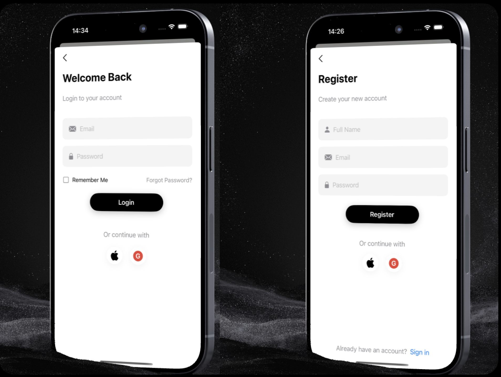
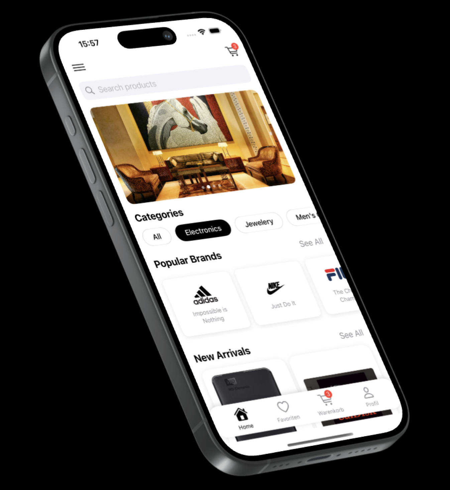
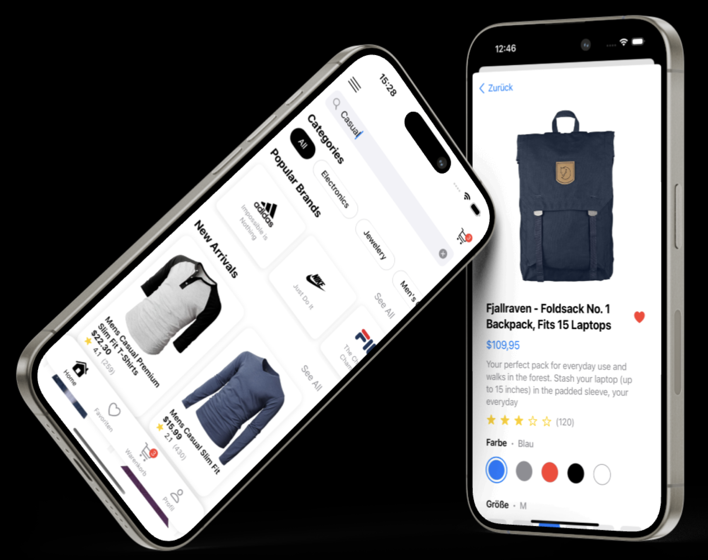
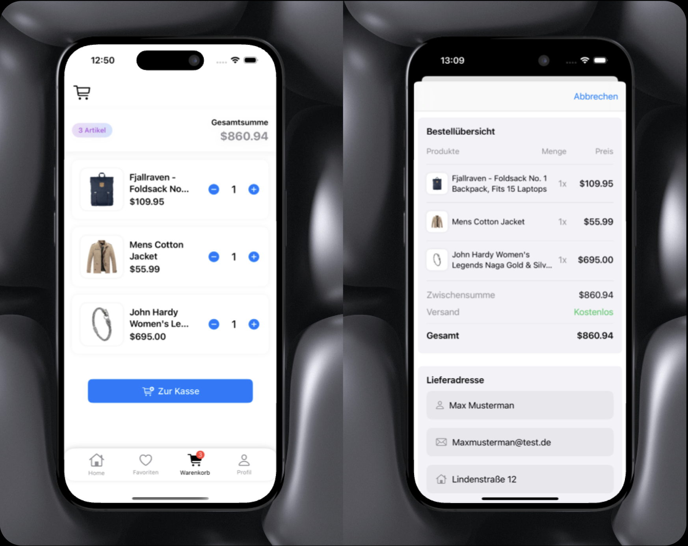
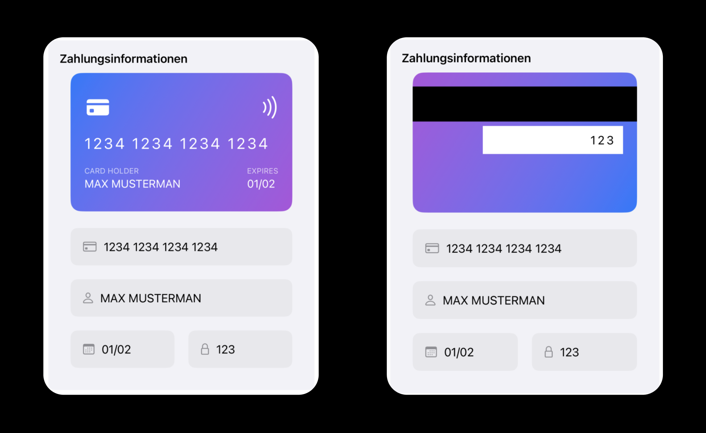
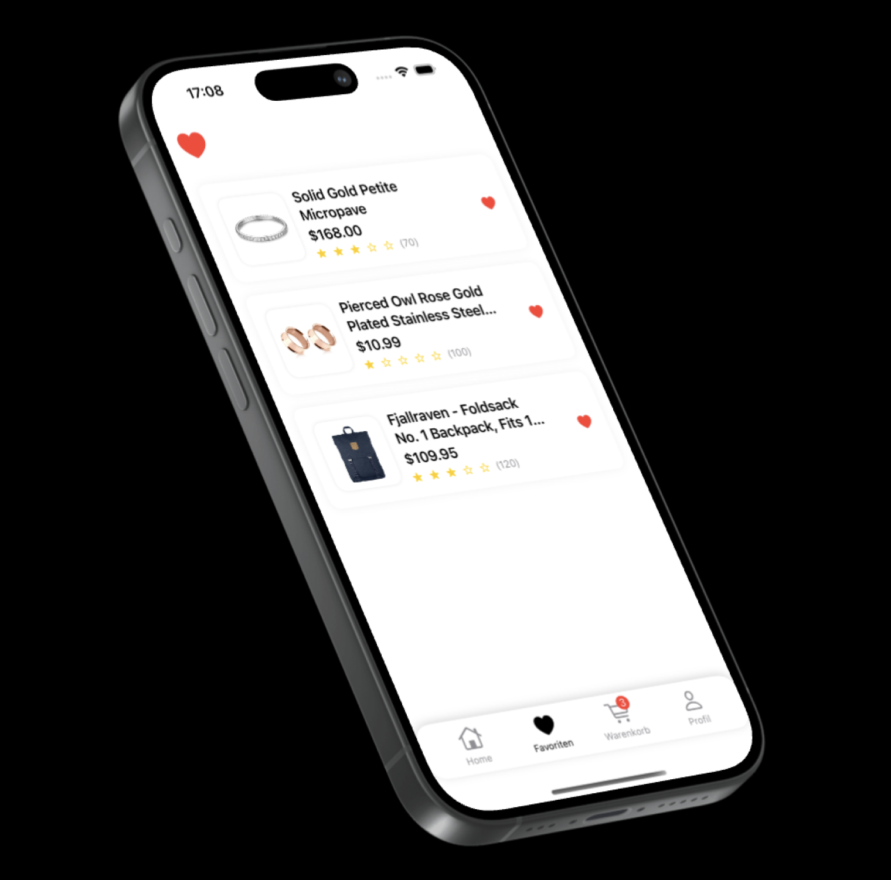

# OnlineShopApp - iOS Shopping App 🛍️

A modern iOS shopping app built with SwiftUI. The app offers an elegant shopping experience focusing on fashion and lifestyle products.

## App Preview 📱

### 🔐 Authentication

  &nbsp;&nbsp;&nbsp;&nbsp;
  

### 🛍️ Shopping Experience

  &nbsp;&nbsp;&nbsp;&nbsp;
  &nbsp;&nbsp;&nbsp;&nbsp;
  

### 🛒 Cart & Favorites

  &nbsp;&nbsp;&nbsp;&nbsp;
  &nbsp;&nbsp;&nbsp;&nbsp;
  

## Key Features 🌟

### 📱 Shopping Experience
- Clean product gallery with grid layout
- Live search with instant results
- Product filtering by categories
- Detailed product views with ratings
- Simple and intuitive navigation
- Optimized image display
- Smart filtering:
  - By category
  - By price (ascending/descending)
  - By ratings
  - By availability

### 🛒 Cart & Checkout
- Intuitive cart with +/- quantity controls
- Automatic total calculation
- Clear order summary
- Validated checkout process
- Animated order confirmation

### ❤️ Personalization
- Animated favorites function with pulsing heart icon
- Persistent wishlist
- Session-based data storage

### 🎨 Design & UI
- Modern, minimalist interface
- Custom TabBar with dynamic badge display
- Consistent color scheme (Blue/White)
- Smooth animations and transitions

### 🔐 Authentication
- Firebase Email/Password Authentication
- Secure Login/Logout flow
- Protected area for logged-in users
- Authentication error handling

## Technical Details 🛠️

### 📐 Architecture
- MVVM architecture
- SwiftUI Framework
- @StateObject/@ObservedObject for state management
- Sheet-based navigation

### 💾 Data Models
- Robust model structure:
  - Product model with rating system
  - Cart & CartItem models
  - Order & Checkout models
- Codable protocol implementation
- Computed properties for price calculations

### 🎯 UI Components
- Reusable components:
  - AddToCartAnimation
  - BrandView
  - BuyLoadingAnimation
  - CategoryButton
  - CheckboxStyle
  - ColorButton
  - CreditCardView
  - CustomSecureField
  - Custom TabBar
  - CustomTextField
  - FilterView
  - ProductCard
  - ProductGridView
  - SearchBarView
  - SizeButton
  - SlideShowView
  - SocialLoginButton
  - TabButton
  - Haptic Feedback Integration

### 🔄 Data Handling
- Asynchronous API calls with async/await
- JSON Decoding with Codable Protocol
- Error handling with custom error types
- In-memory caching for cart/favorites
- Category-based filtering
- Live-search with instant feedback

### 🌐 Networking
- FakeStore API Integration
- RESTful API calls for:
  - Fetching products
  - Loading categories
  - Product details
- Robust error handling with user feedback

### 📊 Analytics
- Firebase Analytics base integration
- Event tracking for:
  - Page views
  - Product views
  - Cart actions
  - Purchases

### 🚀 Features in Development
- Apple/Google Sign-In integration
- Local data persistence
- Enhanced user profiles

## Installation ⚙️

1. Clone repository
2. Open Xcode 15.0+
3. Add Firebase configuration file
4. Build & Run

## Requirements 📋

- iOS 16.0+
- Xcode 15.0+
- Swift 5.9+
- Firebase Account

[]

## Author 👨‍💻

Developed by [Philipp Hermann]

